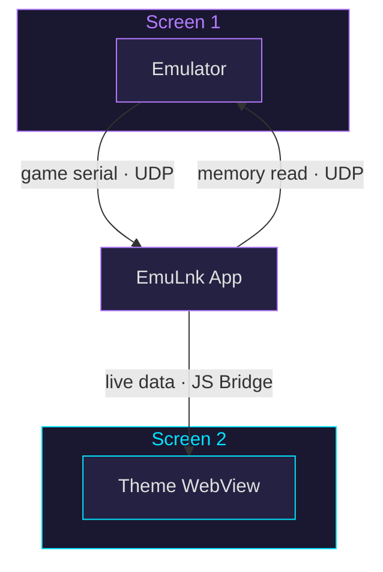

<p align="center">
  
</p>

<p align="center">
  <strong>Emulator companion app that turns your second screen into a themed dashboard.</strong><br/>
  Built for dual-display handhelds.
</p>

<p align="center">
  <a href="https://github.com/EmuLnk/emulnk/releases"></a>
  &nbsp;
  
  &nbsp;
  
  &nbsp;
  <a href="https://github.com/EmuLnk/emulnk/releases"></a>
</p>

<p align="center">
  <a href="https://apps.obtainium.imranr.dev/redirect.html?r=obtainium://add/https://github.com/EmuLnk/emulnk"></a>
</p>

---

## What It Does

EmuLnk connects to emulators over UDP, reads game memory in real time, and renders themed overlays — health bars, inventories, maps, enemy stats — on your second screen. Themes are HTML/CSS/JS WebViews driven by live data defined in JSON profiles.

<p align="center">
  <em>Screenshots coming soon</em>
</p>

## Supported Emulators

| Emulator | Systems | Fork |
|----------|---------|------|
| **RetroArch** | SNES, Genesis, NES, GB, GBC, GBA, PS1, N64 | [`retroarch-lnk`](https://github.com/EmuLnk/retroarch-lnk) |
| **Dolphin** | GameCube, Wii | [`dolphin-lnk`](https://github.com/EmuLnk/dolphin-lnk) |
| **PPSSPP** | PSP | [`ppsspp-lnk`](https://github.com/EmuLnk/ppsspp-lnk) |

> [!NOTE]
> Each emulator fork adds the EmuLnk binary UDP protocol. Install the fork alongside EmuLnk to use it.

## How It Works



1. **Detect** — Sends a UDP request, emulator responds with a platform-prefixed serial (e.g. `SNES:SUPER METROID`)
2. **Match** — Serial maps to a profile defining memory addresses and data types
3. **Poll** — Data points are read from emulator memory each frame
4. **Render** — Live data is pushed to the theme WebView via JavaScript bridge

## Installation

Download the latest APK from [Releases](https://github.com/EmuLnk/emulnk/releases) or import the full EmuLnk suite into [Obtainium](https://github.com/ImranR98/Obtainium):

> [!TIP]
> **[`obtainium.json`](obtainium.json)** — Includes EmuLnk app + all emulator forks + repo tracking, grouped under one category.

## Building from Source

```bash
git clone https://github.com/EmuLnk/emulnk.git
cd emulnk
./gradlew assembleDebug
```

Requires Android SDK 34+ and JDK 17.

## Creating Themes

Themes are self-contained folders with HTML, CSS, JS, and a `theme.json` manifest. See the full documentation:

| Resource | Description |
|----------|-------------|
| [Getting Started](https://github.com/EmuLnk/emulnk-repo/wiki/Getting-Started) | First theme walkthrough |
| [Theme Format](https://github.com/EmuLnk/emulnk-repo/wiki/Theme-Format) | Manifest and file structure |
| [Theme API](https://github.com/EmuLnk/emulnk-repo/wiki/Theme-API) | JavaScript bridge methods |
| [Profile Format](https://github.com/EmuLnk/emulnk-repo/wiki/Profile-Format) | Data point definitions |
| [Platform Quirks](https://github.com/EmuLnk/emulnk-repo/wiki/Platform-Quirks) | System-specific memory notes |

Browse community themes and profiles in [`emulnk-repo`](https://github.com/EmuLnk/emulnk-repo).

## Project Repos

| Repo | Description |
|------|-------------|
| **`emulnk`** | **Android companion app** |
| [`emulnk-repo`](https://github.com/EmuLnk/emulnk-repo) | Themes, profiles, and system configs |
| [`retroarch-lnk`](https://github.com/EmuLnk/retroarch-lnk) | RetroArch fork with UDP protocol |
| [`dolphin-lnk`](https://github.com/EmuLnk/dolphin-lnk) | Dolphin fork with UDP protocol |
| [`ppsspp-lnk`](https://github.com/EmuLnk/ppsspp-lnk) | PPSSPP fork with UDP protocol |

## License

[GPLv3](LICENSE)
